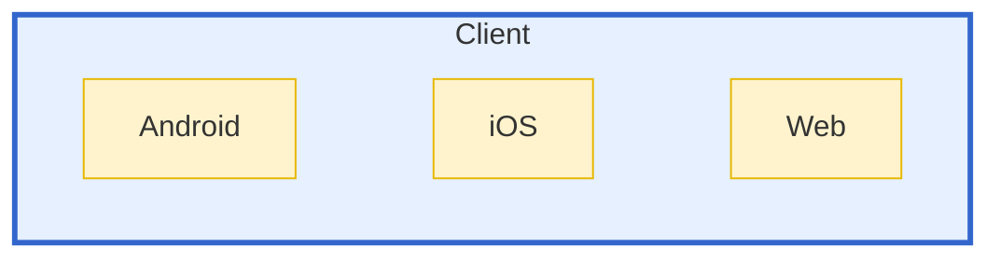
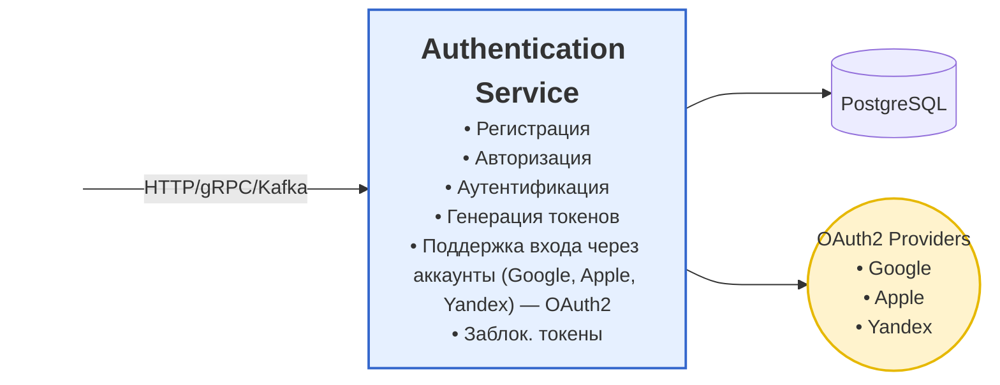
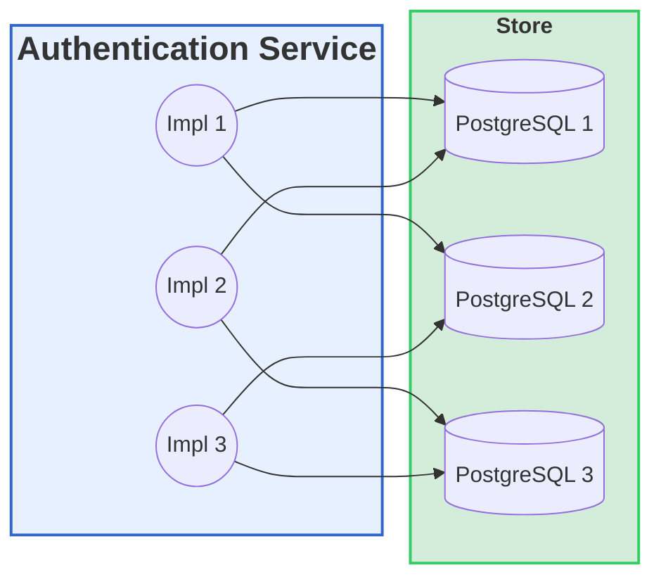
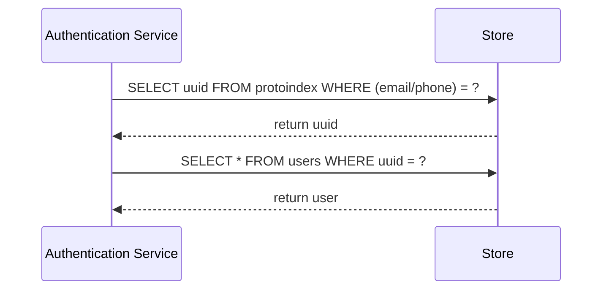
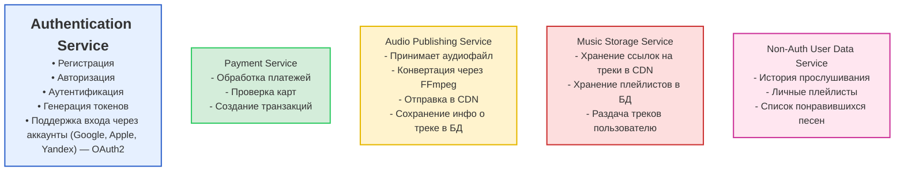

# Архитектура музыкальной платформы ТУНЕЦ

## Клиентские приложения

----
----
## Authentication Service

### горизонтальное масштабирование Authentication Service

| Таблица       | Поля                     | Назначение                                                              |
|---------------|--------------------------|-------------------------------------------------------------------------|
| **users**     | uuid, email, phone, …    | Основная таблица пользователей (хранит полный профиль пользователя)     |
| **protoindex**| (email/phone), uuid      | Вспом.таблица для распределённого поиска (по уникальному полю ищет uuid)|

UI отправляет запрос к API, который обрабатывает запрос и взаимодействует с базой данных PostgreSQL и сервисом авторизации (Auth Service).  

## Диаграмма потока

