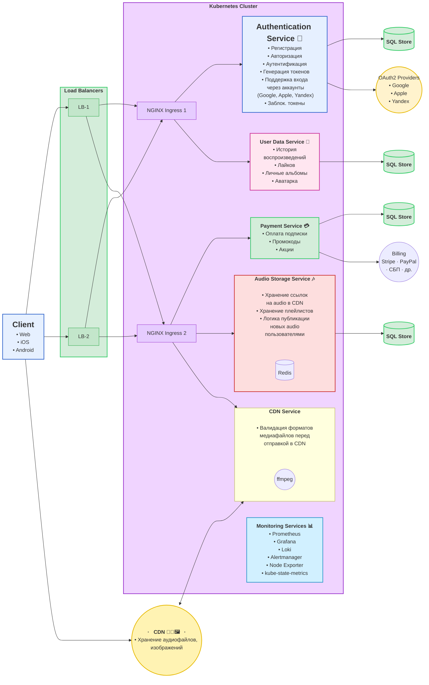
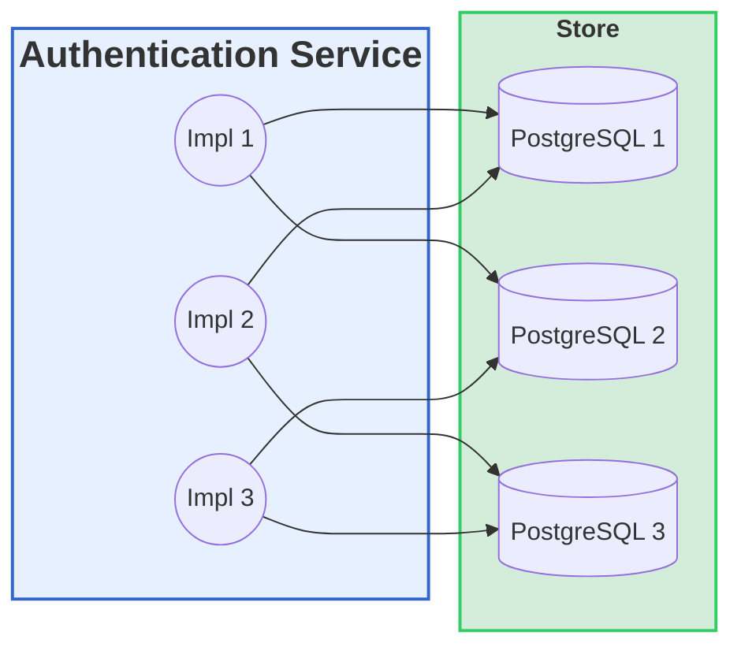
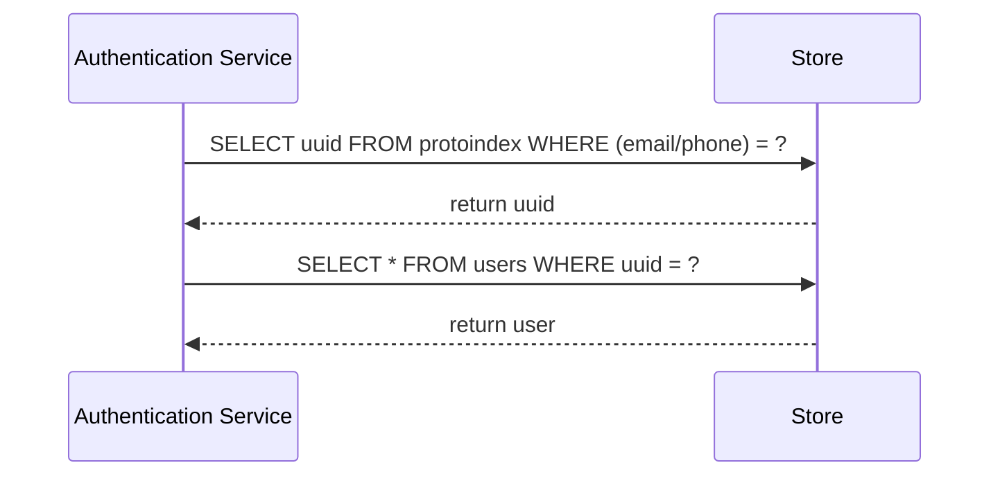

# Архитектура музыкальной платформы ТУНЕЦ

----
----
## Пример горизонтального масштабирования Authentication Service

| Таблица       | Поля                     | Назначение                                                              |
|---------------|--------------------------|-------------------------------------------------------------------------|
| **users**     | uuid, email, phone, …    | Основная таблица пользователей (хранит полный профиль пользователя)     |
| **protoindex**| (email/phone), uuid      | Вспом.таблица для распределённого поиска (по уникальному полю ищет uuid)|

