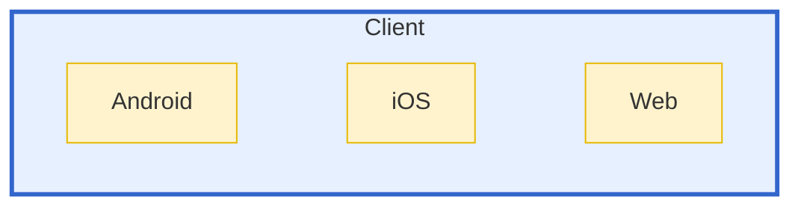
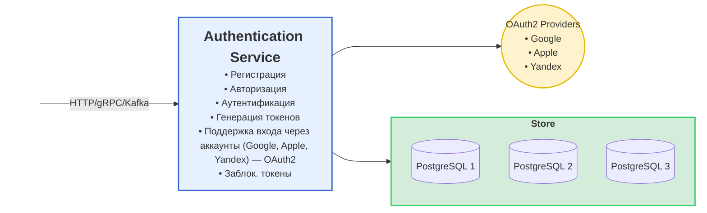
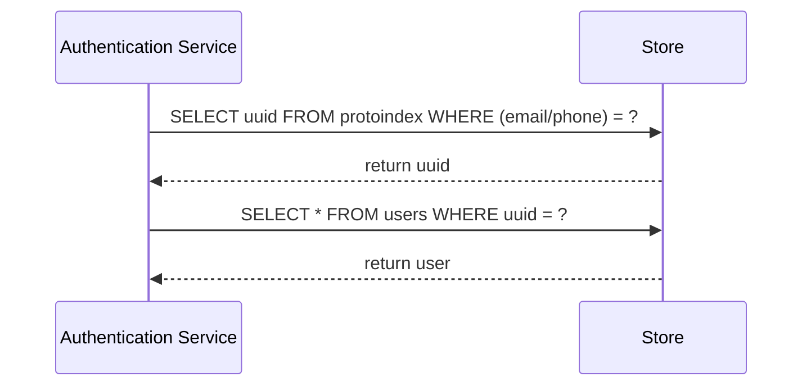
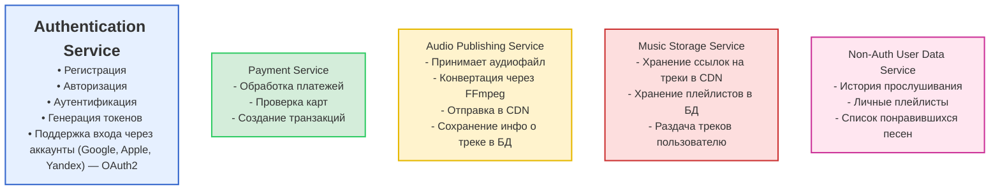

# Архитектура музыкальной платформы ТУНЕЦ

## Клиентские приложения

----
## Authentication Service

UI отправляет запрос к API, который обрабатывает запрос и взаимодействует с базой данных PostgreSQL и сервисом авторизации (Auth Service).  

## Диаграмма потока

