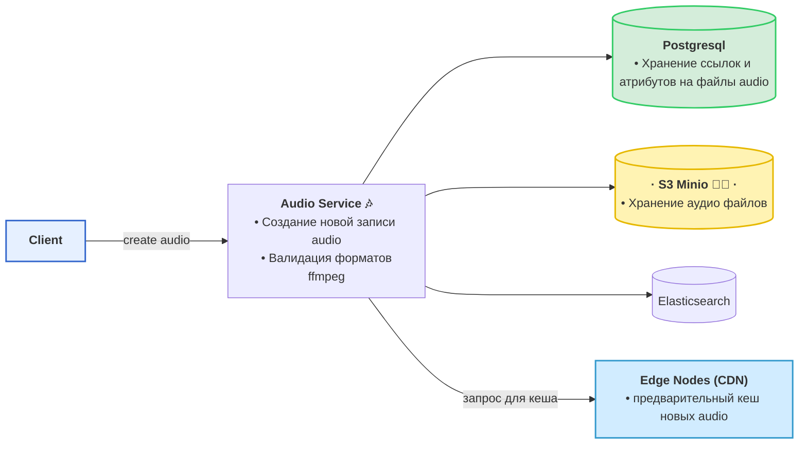
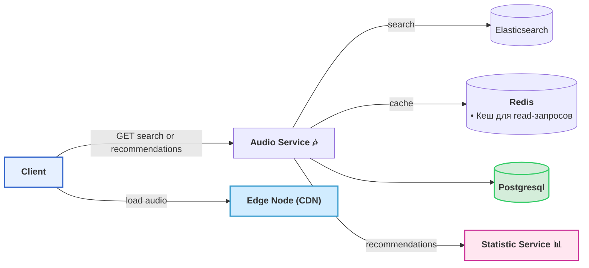

# Схема создания аудио контента, хранения, сбора статистики и анализа

### Создание, хранение, публикация
- клиент обращается на сервис для создания нового аудиотрека
- сервис обрабатывает аудиофайл, приводит его к единому формату при помощи утилиты ffmpeg
- сохраняет файл в S3 хранилище
- сохраняет метаданные аудиофайла (ссылка файла в S3, атрибуты оценки произведения выставленные создателем, стиль, жанр и др.) в бд Postgres
- отправляет запись в Elasticsearch
- делает запрос на ноды CDN для предварительного кеширования (можно простой запрос на получение файла автоматом закеширует файл)
- свеже созданные записи будут активно продвигаться первые сутки, CDN файлы cо свежим временем создания кеширует на большее время
- система рекомендаций активно продвигает новые записи

### Чтение пользователями записей audio
- пользователь обращается на Audio Service для получения списков audio
- Audio Service обращается к Elasticsearch при запросе от пользователя поиска аудиотреков по имени или другим текстовым атрибутам
- Elasticsearch выдает сервису список подходящих id аудиотреков
- сервис по полученным id запрашивает обьекты audio у Redis или Postgresql
- для получения списка id рекомендованных пользвателю audio  Audio Service делает запрос на Statistic Service
- Audio Service может сортировать записи перед отдачей например если их создатели платят за продвижение
- после получения метаданных о треках пользователь загружает файл-audio c CDN

