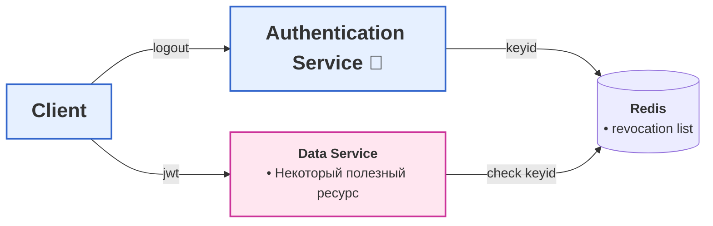

# Общая архетиктура

- схема логаута при использовании jwt
  1) клиент делает logout
  2) auth сервис вносит keyid jwt токена в revocation list редиса
  3) сервис, предоставляющий некую информацию пользователю при проверке jwt проверяет наличие его keyid в revocation list

