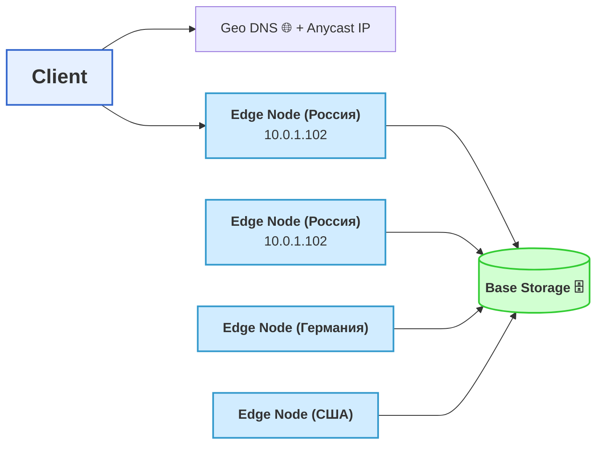
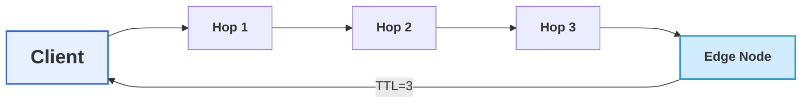
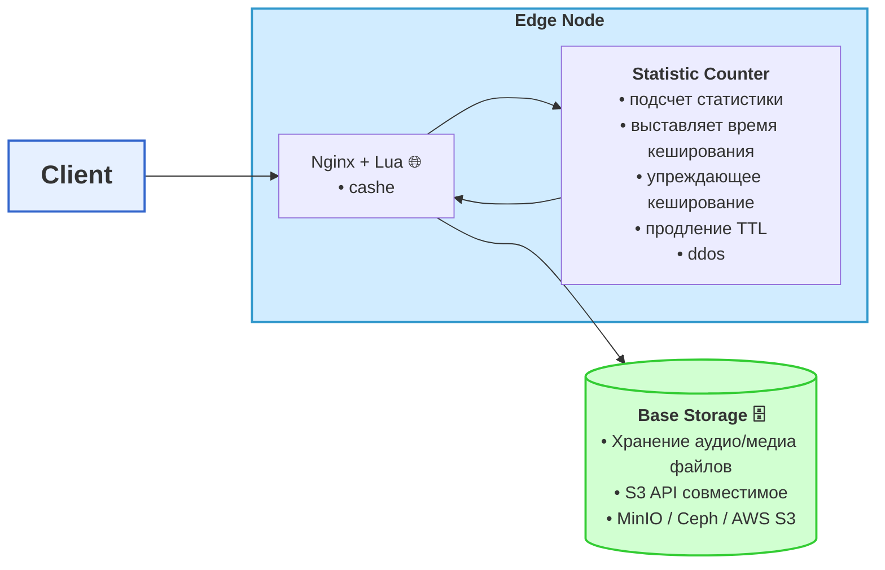

# Архитектура CDN

## Выбор Edge Node

```mermaid
graph LR

    CLIENT["<b><font size='5'>Client</font></b>"]


    GEO_DNS["Geo DNS 🌐 + Anycast IP"]


    EDGE_NODE1["<b>Edge Node (Россия)</b><br/> 10.0.1.102"]
    EDGE_NODE2["<b>Edge Node (Россия)</b><br/> 10.0.1.102"]
    EDGE_NODE3["<b>Edge Node (Германия)</b>"]
    EDGE_NODE4["<b>Edge Node (США)</b>"]

    BASE_STORAGE[("<b>Base Storage 🗄️</b>")]

    
    CLIENT ---> GEO_DNS
    CLIENT ---> EDGE_NODE1

    EDGE_NODE1 ---> BASE_STORAGE
    EDGE_NODE2 ---> BASE_STORAGE
    EDGE_NODE3 ---> BASE_STORAGE
    EDGE_NODE4 ---> BASE_STORAGE


    style EDGE_NODE1 fill:#d1ecff,stroke:#3399cc,stroke-width:2px
    style EDGE_NODE2 fill:#d1ecff,stroke:#3399cc,stroke-width:2px
    style EDGE_NODE3 fill:#d1ecff,stroke:#3399cc,stroke-width:2px
    style EDGE_NODE4 fill:#d1ecff,stroke:#3399cc,stroke-width:2px
    style CLIENT fill:#e6f0ff,stroke:#3366cc,stroke-width:2px
    style BASE_STORAGE fill:#d1ffd1,stroke:#33cc33,stroke-width:2px

```
## Выбор Edge Node ( 2-вариант ВК)

```mermaid
graph LR

    CLIENT["<b><font size='5'>Client</font></b>"]

    HOP1["<b>Hop 1</b>"]
    HOP2["<b>Hop 2</b>"]
    HOP3["<b>Hop 3</b>"]

    EDGE_NODE["<b>Edge Node</b>"]

  CLIENT ---> HOP1
  HOP1 ---> HOP2
  HOP2 ---> HOP3
  HOP3 ---> EDGE_NODE
  EDGE_NODE ---> |TTL=3| CLIENT
  
    style EDGE_NODE fill:#d1ecff,stroke:#3399cc,stroke-width:2px
    style CLIENT fill:#e6f0ff,stroke:#3366cc,stroke-width:2px

```

## Архетиктура Edge Node

```mermaid
graph LR

    CLIENT["<b><font size='5'>Client</font></b>"]

    subgraph EDGE_NODE["<b>Edge Node</b>"]
      direction TB
      NGINX_LUA["Nginx + Lua 🌐<br/>• cashe"]
      STAT_COUNTER["<b>Statistic Counter</b><br/>• подсчет статистики<br/>• выставляет время кеширования<br/>• упреждающее кеширование<br/>• продление TTL<br/>• ddos"]
    end


    CLIENT ---> NGINX_LUA
    NGINX_LUA --> STAT_COUNTER
    STAT_COUNTER ---> NGINX_LUA

    BASE_STORAGE[("<b>Base Storage 🗄️</b><br/>• Хранение аудио/медиа файлов<br/>• S3 API совместимое<br/>• MinIO / Ceph / AWS S3")]

    NGINX_LUA ---> BASE_STORAGE

    style EDGE_NODE fill:#d1ecff,stroke:#3399cc,stroke-width:2px
    style CLIENT fill:#e6f0ff,stroke:#3366cc,stroke-width:2px
    style BASE_STORAGE fill:#d1ffd1,stroke:#33cc33,stroke-width:2px

```

