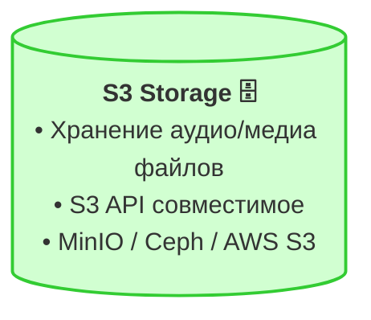

# Архитектура музыкальной платформы ТУНЕЦ

```mermaid
graph LR


  S3_STORAGE[("<b>S3 Storage 🗄️</b><br/>• Хранение аудио/медиа файлов<br/>• S3 API совместимое<br/>• MinIO / Ceph / AWS S3")]

    style S3_STORAGE fill:#d1ffd1,stroke:#33cc33,stroke-width:2px

```

