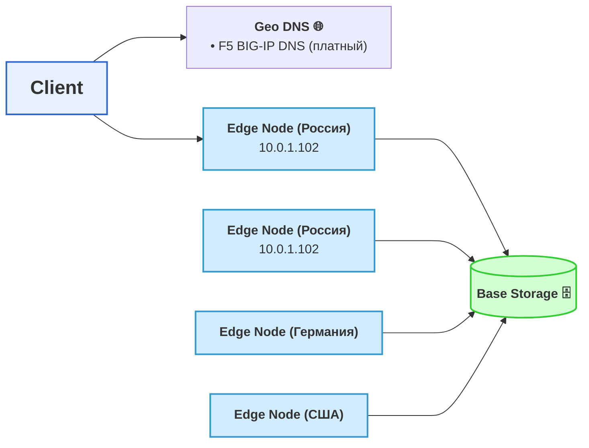
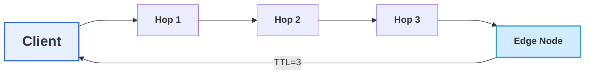
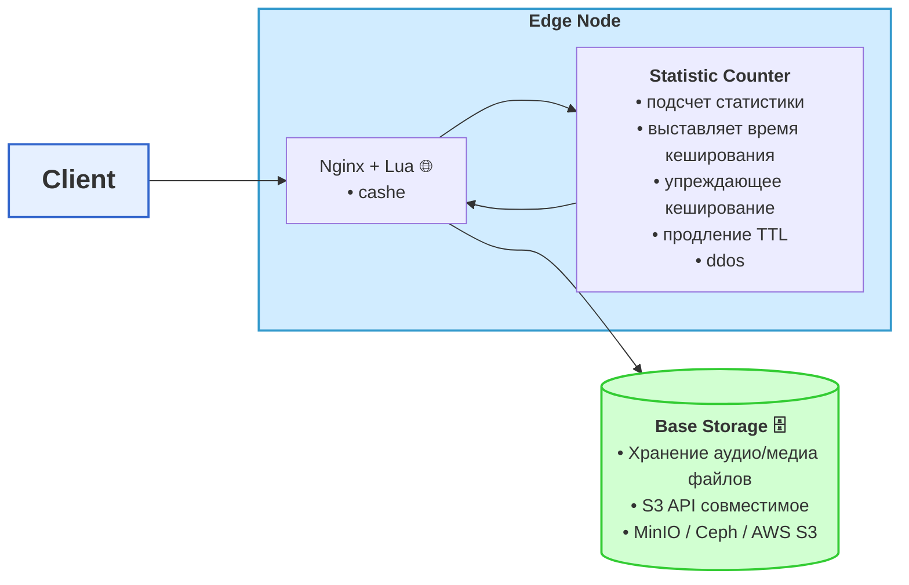
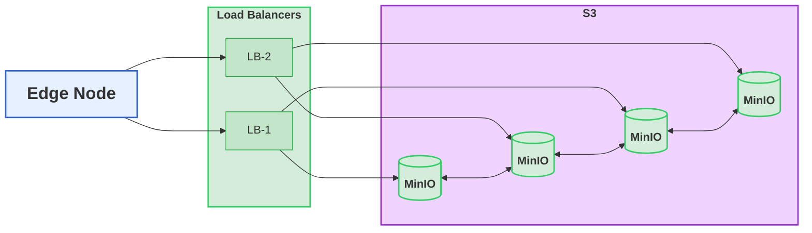

# Архитектура CDN

## Выбор Edge Node

## Выбор Edge Node ( 2-вариант ВК)
минусы: множественные запросы на Edge_Node для проверки длины пути; дополнительный код на клиенте

## Архетиктура Edge Node

# Base Storage

