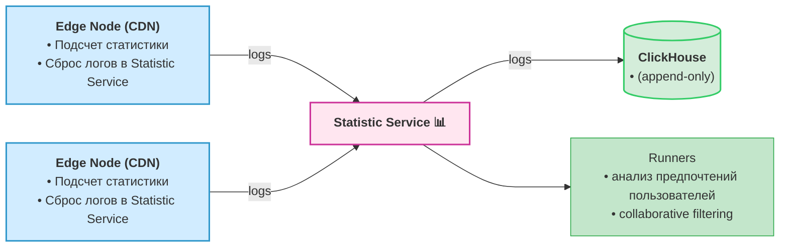

### Сбор статистики, просчет рекомендаций для пользователя
- Statistic Service собирает статистику по прослушиваниям треков а также делает просчет рекомендаций для пользователей (можно поделить на 2 сервиса)
- каждая Edge Node (CDN) ведет подсчет количесва обращений пользователей за аудио, а также запоминает id самих пользователей, некоторые вспомогательные метаданные например время прослушивания
- в определенные промежутки времени скидывает статистику на Statistic Service
- Statistic Service пишет логи прослушиваний в ClickHouse (append-only)
- раз в сутки запускаются Runners анализа collaborative filtering, полученные результаты созраняются в туже или свою ClickHouse

